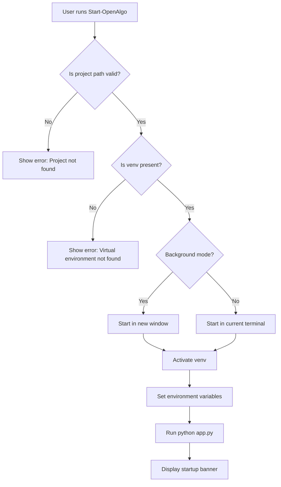

# OpenAlgo PowerShell Module Plan

## Overview

Create a PowerShell module that allows running OpenAlgo from anywhere on the system by simply typing `Start-OpenAlgo` or `openalgo`.

## Requirements

Based on the user's workflow:
1. Navigate to `C:\Users\agraw\GIT\openalgo`
2. Activate virtual environment: `.\.venv\Scripts\activate`
3. Run the app: `py .\app.py`

## Module Design

### Files to Create

```
openalgo-ps-module/
├── OpenAlgo.psm1           # Main module script
├── OpenAlgo.psd1           # Module manifest
└── Install-OpenAlgoModule.ps1  # Installation script
```

### Module Location

The module will be installed to:
```
C:\Users\agraw\Documents\WindowsPowerShell\Modules\OpenAlgo\
```

Or for PowerShell Core (pwsh):
```
C:\Users\agraw\Documents\PowerShell\Modules\OpenAlgo\
```

### Features

1. **Start-OpenAlgo** - Main function to start the application
   - Automatically navigates to project directory
   - Activates virtual environment
   - Starts the Flask app
   - Supports optional parameters for host, port, debug mode

2. **OpenAlgo alias** - Short command `openalgo` for quick access

3. **Stop-OpenAlgo** - Function to stop any running OpenAlgo instances

4. **Get-OpenAlgoStatus** - Check if OpenAlgo is running

### Parameters for Start-OpenAlgo

| Parameter | Type | Default | Description |
|-----------|------|---------|-------------|
| HostIP | string | 127.0.0.1 | Host IP to bind |
| Port | int | 5000 | Port to listen on |
| Debug | switch | false | Enable debug mode |
| NoActivate | switch | false | Skip venv activation |
| Background | switch | false | Run in background |

### Usage Examples

```powershell
# Basic usage - start OpenAlgo with defaults
Start-OpenAlgo

# Using the alias
openalgo

# Start with custom port
Start-OpenAlgo -Port 8080

# Start in debug mode
Start-OpenAlgo -Debug

# Start accessible from network
Start-OpenAlgo -HostIP "0.0.0.0"

# Start in background
Start-OpenAlgo -Background
```

## Implementation Details

### OpenAlgo.psm1

```powershell
# Constants
$script:OpenAlgoPath = "C:\Users\agraw\GIT\openalgo"
$script:VenvPath = Join-Path $script:OpenAlgoPath ".venv"
$script:AppPath = Join-Path $script:OpenAlgoPath "app.py"

function Start-OpenAlgo {
    [CmdletBinding()]
    param(
        [string]$HostIP = "127.0.0.1",
        [int]$Port = 5000,
        [switch]$Debug,
        [switch]$NoActivate,
        [switch]$Background
    )
    
    # Implementation...
}

function Stop-OpenAlgo {
    # Stop running instances
}

function Get-OpenAlgoStatus {
    # Check status
}

# Export functions
Export-ModuleMember -Function Start-OpenAlgo, Stop-OpenAlgo, Get-OpenAlgoStatus

# Create alias
Set-Alias -Name openalgo -Value Start-OpenAlgo
Export-ModuleMember -Alias openalgo
```

### Installation Script

The installation script will:
1. Create the module directory if it doesn't exist
2. Copy module files to the correct location
3. Add the module to PowerShell profile for auto-loading

## Workflow Diagram



## Next Steps

1. Create the `OpenAlgo.psm1` module file
2. Create the `OpenAlgo.psd1` manifest file
3. Create the `Install-OpenAlgoModule.ps1` installation script
4. Test the module installation and usage
