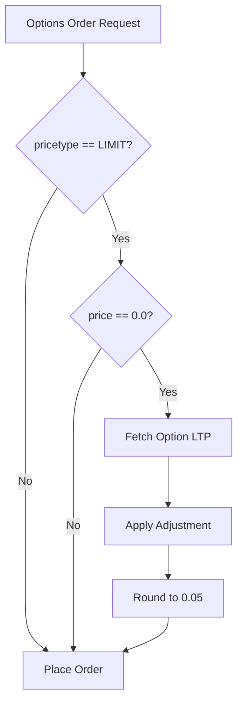

# Price Discovery Improvements Plan

## Overview

This plan outlines improvements to the price discovery mechanism in the options order flow. The current implementation in [`place_options_order_service.py`](../services/place_options_order_service.py) has several areas for enhancement.

## Current Implementation Analysis

### Existing Flow



### Current Code Location

File: [`services/place_options_order_service.py`](../services/place_options_order_service.py:230-316)

### Issues Identified

1. **Hardcoded Tick Size**: Line 286 uses hardcoded `0.05`
2. **LTP Only**: Uses only LTP, not bid/ask prices
3. **No Cap on Adjustment**: No validation for excessive adjustments
4. **Limited Logging**: Insufficient audit trail logging

---

## Improvement 1: Configurable Tick Size

### Problem

```python
# Current implementation - line 286
discovered_price = round(discovered_price / 0.05) * 0.05
```

### Solution

The `tick_size` is already available from the option symbol resolution response. Use it instead of hardcoded value.

### Implementation Details

**File**: `services/place_options_order_service.py`

**Step 1**: Extract tick_size from symbol resolution response (around line 210-228)

```python
# After symbol resolution
resolved_symbol = symbol_response.get("symbol")
resolved_exchange = symbol_response.get("exchange")
underlying_ltp = symbol_response.get("underlying_ltp")
tick_size = symbol_response.get("tick_size", 0.05)  # NEW: Get tick_size with fallback
```

**Step 2**: Use tick_size in price rounding (line 286)

```python
# Replace hardcoded 0.05 with tick_size from database
discovered_price = round(discovered_price / tick_size) * tick_size
```

### Tick Size Values by Exchange

| Exchange | Typical Tick Size |
|----------|-------------------|
| NFO (options) | 0.05 |
| BFO (options) | 0.05 |
| CDS (currency) | 0.0025 |
| MCX (commodities) | Varies by instrument |

---

## Improvement 2: Bid-Ask Spread Awareness

### Problem

Current implementation uses only LTP for price discovery. For better fill rates:
- BUY orders should use ask price (willing to pay what sellers are asking)
- SELL orders should use bid price (willing to sell at what buyers are bidding)

### Current Quote Response Structure

The [`get_quotes()`](../services/quotes_service.py) function already returns bid/ask prices from broker APIs:

```python
# From broker/zerodha/api/data.py and broker/angel/api/data.py
return {
    "ask": quote.get("depth", {}).get("sell", [{}])[0].get("price", 0),
    "bid": quote.get("depth", {}).get("buy", [{}])[0].get("price", 0),
    "ltp": quote.get("last_price", 0),
    # ... other fields
}
```

### Solution

Use bid/ask prices directly without a flag:
- **BUY orders**: Use ask price (price to buy from sellers)
- **SELL orders**: Use bid price (price to sell to buyers)
- **Fallback**: Use LTP if bid/ask not available

**Service Update**: `services/place_options_order_service.py`

```python
# In price discovery section (around line 255-284)
option_ltp = quote_response.get("data", {}).get("ltp")
option_bid = quote_response.get("data", {}).get("bid", 0)
option_ask = quote_response.get("data", {}).get("ask", 0)

# Determine base price based on action
# BUY: Use ask price (what sellers are asking)
# SELL: Use bid price (what buyers are bidding)
if action == "BUY":
    if option_ask > 0:
        base_price = option_ask
        price_source = "ask"
    else:
        # Fallback to LTP if ask not available
        base_price = option_ltp
        price_source = "ltp_fallback"
else:  # SELL
    if option_bid > 0:
        base_price = option_bid
        price_source = "bid"
    else:
        # Fallback to LTP if bid not available
        base_price = option_ltp
        price_source = "ltp_fallback"

# Apply adjustment to base price
if adjustment_type == "percentage":
    if action == "BUY":
        discovered_price = base_price * (1 + adjustment_value / 100)
    else:
        discovered_price = base_price * (1 - adjustment_value / 100)
elif adjustment_type == "absolute":
    if action == "BUY":
        discovered_price = base_price + adjustment_value
    else:
        discovered_price = base_price - adjustment_value
else:
    discovered_price = base_price
```

### Behavior Summary

| Action | Base Price | Adjustment |
|--------|------------|------------|
| BUY | ask (fallback: ltp) | + adjustment |
| SELL | bid (fallback: ltp) | - adjustment |

---

## Improvement 3: Maximum Adjustment Cap

### Problem

No validation prevents users from specifying excessive adjustments that could result in unfavorable prices.

### Solution

Add validation to cap adjustments at a maximum percentage (default 10%).

**Schema Update**: Add validation to `OptionsOrderSchema`

```python
# In restx_api/schemas.py - OptionsOrderSchema
price_adjustment_value = fields.Float(
    missing=2.0,
    validate=validate.Range(min=0, max=10.0, error="Adjustment value must be between 0 and 10"),
    metadata={
        "description": "Adjustment value (percentage or absolute amount). "
        "Maximum allowed: 10 for percentage, 10.0 for absolute. "
        "Always specify as positive value - direction is determined by order action. "
        "Default: 2.0 (2% when using percentage type)"
    },
)
```

**Service Update**: Add validation in price discovery

```python
# Constants at top of file
MAX_ADJUSTMENT_PERCENT = 10.0
MAX_ADJUSTMENT_ABSOLUTE = 10.0

# In price discovery section
adjustment_type = options_data.get("price_adjustment_type")
adjustment_value = options_data.get("price_adjustment_value", 2.0)

# Validate adjustment limits
if adjustment_type == "percentage" and adjustment_value > MAX_ADJUSTMENT_PERCENT:
    return (
        False,
        {
            "status": "error",
            "message": f"Adjustment value {adjustment_value}% exceeds maximum allowed {MAX_ADJUSTMENT_PERCENT}%",
        },
        400,
    )

if adjustment_type == "absolute" and adjustment_value > MAX_ADJUSTMENT_ABSOLUTE:
    return (
        False,
        {
            "status": "error",
            "message": f"Absolute adjustment value {adjustment_value} exceeds maximum allowed {MAX_ADJUSTMENT_ABSOLUTE}",
        },
        400,
    )
```

---

## Improvement 4: Enhanced Logging for Audit Trails

### Problem

Current logging is minimal. Production trading requires detailed audit trails.

### Solution

Add comprehensive logging for price discovery process.

**Implementation**: Add detailed logging throughout price discovery

```python
# In price discovery section
import json
from datetime import datetime

# Log price discovery start
logger.info(
    f"PRICE_DISCOVERY_START: {
        'symbol': resolved_symbol,
        'exchange': resolved_exchange,
        'action': action,
        'pricetype': pricetype,
        'requested_price': price,
        'timestamp': datetime.now().isoformat(),
    }"
)

# After fetching quotes
logger.info(
    f"PRICE_DISCOVERY_QUOTES: {
        'symbol': resolved_symbol,
        'ltp': option_ltp,
        'bid': option_bid,
        'ask': option_ask,
        'use_bid_ask': use_bid_ask,
        'base_price': base_price,
        'price_source': price_source,
    }"
)

# After applying adjustment
logger.info(
    f"PRICE_DISCOVERY_ADJUSTMENT: {
        'symbol': resolved_symbol,
        'adjustment_type': adjustment_type,
        'adjustment_value': adjustment_value,
        'base_price': base_price,
        'adjusted_price': discovered_price,
    }"
)

# After rounding
logger.info(
    f"PRICE_DISCOVERY_COMPLETE: {
        'symbol': resolved_symbol,
        'final_price': discovered_price,
        'tick_size': tick_size,
        'action': action,
        'timestamp': datetime.now().isoformat(),
    }"
)
```

### Log Format for Audit

All price discovery logs should include:
- Symbol and exchange
- Action (BUY/SELL)
- Timestamp
- Input parameters (adjustment type/value, use_bid_ask)
- Quote data (ltp, bid, ask)
- Intermediate calculations (base_price, adjusted_price)
- Final result (discovered_price)

---

## Implementation Checklist

### Phase 1: Tick Size Configuration
- [ ] Modify `place_options_order_service.py` to extract tick_size from symbol_response
- [ ] Replace hardcoded 0.05 with tick_size variable
- [ ] Test with different exchanges (NFO, CDS, MCX)

### Phase 2: Bid-Ask Spread Awareness
- [ ] Update API documentation in `restx_api/options_order.py`
- [ ] Modify price discovery logic to use bid/ask prices
- [ ] Add fallback to LTP when bid/ask unavailable
- [ ] Test BUY orders with ask price
- [ ] Test SELL orders with bid price

### Phase 3: Maximum Adjustment Cap
- [ ] Add validation to schema for max adjustment value
- [ ] Add service-level validation
- [ ] Add appropriate error messages
- [ ] Test with excessive adjustment values

### Phase 4: Enhanced Logging
- [ ] Add structured logging throughout price discovery
- [ ] Ensure all key parameters are logged
- [ ] Add timestamps for audit trails
- [ ] Test log output format

---

## API Documentation Updates

Update the docstring in [`restx_api/options_order.py`](../restx_api/options_order.py) to reflect new behavior:

```python
"""
Price Discovery Parameters:
    price_adjustment_type: "percentage" or "absolute" or null (default: "percentage")
    price_adjustment_value: Adjustment amount, max 10 (default: 2.0)
    
Price Discovery Behavior:
    BUY orders: Uses ask price + adjustment (fallback to LTP if ask unavailable)
    SELL orders: Uses bid price - adjustment (fallback to LTP if bid unavailable)

Examples:
    1. BUY order: price=0.0
       -> If ask=102, adjustment=2%, final price = 102 + 2% = 104.04
    2. SELL order: price=0.0
       -> If bid=98, adjustment=2%, final price = 98 - 2% = 96.04
    3. BUY with absolute adjustment: price=0.0, price_adjustment_type="absolute", price_adjustment_value=5
       -> If ask=100, final price = 100 + 5 = 105
"""
```

---

## Testing Strategy

### Unit Tests

1. Test tick_size extraction from symbol_response
2. Test price rounding with different tick sizes
3. Test bid/ask price selection logic
4. Test adjustment cap validation
5. Test fallback to LTP when bid/ask unavailable

### Integration Tests

1. Place BUY option order with price discovery
2. Place SELL option order with price discovery
3. Test with different exchanges (NFO, CDS)
4. Test with excessive adjustment values
5. Verify audit log output

---

## Risk Assessment

| Risk | Mitigation |
|------|------------|
| Tick size not available in DB | Fallback to 0.05 default |
| Bid/ask not available | Fallback to LTP |
| Breaking existing API | All new params have defaults matching current behavior |
| Performance impact from logging | Use structured logging with level control |

---

## Estimated Effort

| Task | Complexity |
|------|------------|
| Tick Size Configuration | Low |
| Bid-Ask Spread Awareness | Medium |
| Maximum Adjustment Cap | Low |
| Enhanced Logging | Low |

Total: Medium complexity, low risk implementation.