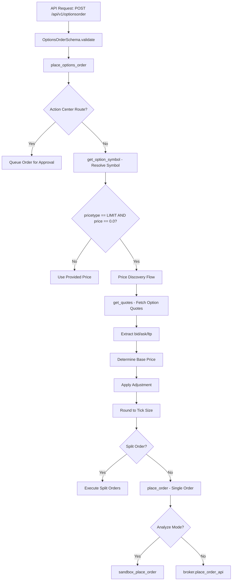
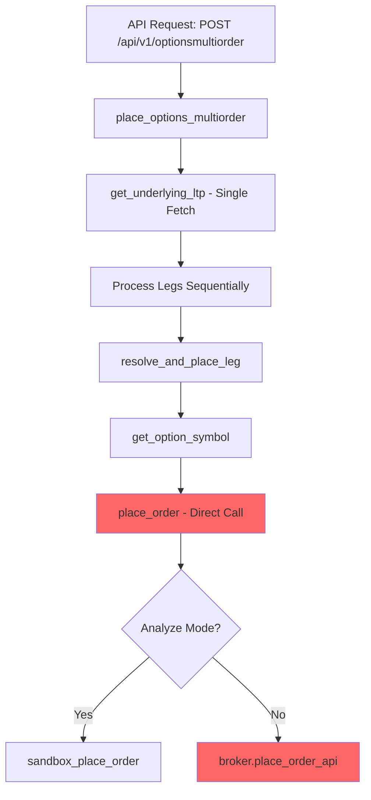
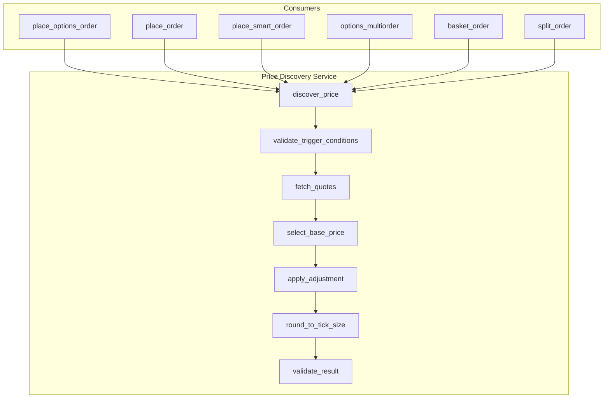

# Price Discovery Technical Review

## Executive Summary

This technical review analyzes the price discovery mechanism across the OpenAlgo codebase, identifying logic integrity issues, performance bottlenecks, edge-case handling gaps, and execution path inconsistencies for limit options orders.

---

## 1. Price Discovery Implementation Overview

### 1.1 Services with Price Discovery

| Service | Price Discovery | Implementation Quality |
|---------|-----------------|------------------------|
| [`place_options_order_service.py`](../services/place_options_order_service.py) | Full | Comprehensive with adjustment, tick size, bid/ask |
| [`place_order_service.py`](../services/place_order_service.py) | Basic | Simple bid/ask with LTP fallback |
| [`place_smart_order_service.py`](../services/place_smart_order_service.py) | Basic | Simple bid/ask with LTP fallback |
| [`options_multiorder_service.py`](../services/options_multiorder_service.py) | **Missing** | No price discovery per leg |
| [`basket_order_service.py`](../services/basket_order_service.py) | **Missing** | No price discovery per order |
| [`split_order_service.py`](../services/split_order_service.py) | **Missing** | No price discovery per split |
| [`sandbox_service.py`](../services/sandbox_service.py) | **Missing** | No price discovery in analyze mode |

### 1.2 Price Discovery Trigger Condition

All implementations use the same trigger condition:
```python
if pricetype == "LIMIT" and price == 0:
```

---

## 2. Execution Path Analysis for Limit Options Orders

### 2.1 Standard Options Order Flow



### 2.2 Options Multi-Order Flow - **GAP IDENTIFIED**



**Critical Gap**: The multi-order flow calls [`place_order()`](../services/place_order_service.py:364) directly but **does NOT trigger price discovery** because:
1. The `pricetype` and `price` are passed through unchanged
2. Price discovery in `place_order_service.py` only triggers when `price == 0`
3. The leg data typically has `price: 0.0` but this is not handled for multi-order legs

### 2.3 Execution Path Trace - Limit Options Order

For a limit options order with `price=0.0`:

1. **Entry Point**: [`restx_api/options_order.py:OptionsOrder.post()`](../restx_api/options_order.py:138)
2. **Schema Validation**: [`OptionsOrderSchema`](../restx_api/schemas.py) - validates request
3. **Service Call**: [`place_options_order()`](../services/place_options_order_service.py:108)
4. **Symbol Resolution**: [`get_option_symbol()`](../services/option_symbol_service.py) - lines 199-207
5. **Price Discovery Check**: Line 240 - `if pricetype == "LIMIT" and price == 0.0:`
6. **Quote Fetch**: [`get_quotes()`](../services/quotes_service.py:159) - lines 244-246
7. **Price Calculation**: Lines 271-347 - bid/ask selection, adjustment, rounding
8. **Order Placement**: [`place_order()`](../services/place_order_service.py:364) - line 541

---

## 3. Logic Integrity Issues

### 3.1 Inconsistent Price Discovery Depth

**Issue**: Price discovery implementation varies significantly across services.

| Feature | place_options_order | place_order | place_smart_order |
|---------|--------------------|-------------|-------------------|
| Bid/Ask Selection | Full | Basic | Basic |
| Tick Size Rounding | From DB | Hardcoded | None |
| Adjustment Support | Yes | No | No |
| Adjustment Validation | Yes | No | No |
| Audit Logging | Comprehensive | Minimal | Minimal |

**Location**: 
- [`place_options_order_service.py:235-386`](../services/place_options_order_service.py:235)
- [`place_order_service.py:267-309`](../services/place_order_service.py:267)
- [`place_smart_order_service.py:290-332`](../services/place_smart_order_service.py:290)

**Impact**: Users get different price discovery behavior depending on the API endpoint used.

### 3.2 Missing Price Discovery in Multi-Order Flows

**Issue**: [`options_multiorder_service.py`](../services/options_multiorder_service.py) does not implement price discovery for individual legs.

**Location**: [`resolve_and_place_leg()`](../services/options_multiorder_service.py:183) - lines 327-341

```python
# Current implementation - NO price discovery
order_data = {
    "apikey": api_key,
    "strategy": common_data.get("strategy"),
    "exchange": resolved_exchange,
    "symbol": resolved_symbol,
    "action": leg_data.get("action"),
    "quantity": leg_data.get("quantity"),
    "pricetype": leg_data.get("pricetype", "MARKET"),
    "product": leg_data.get("product", "MIS"),
    "price": leg_data.get("price", 0.0),  # Passed as-is, no discovery
    # ...
}
```

**Impact**: Multi-leg strategies cannot use automatic price discovery for limit orders.

### 3.3 Missing Price Discovery in Basket Orders

**Issue**: [`basket_order_service.py`](../services/basket_order_service.py) does not implement price discovery for individual orders.

**Location**: [`place_single_order()`](../services/basket_order_service.py:131) - lines 151-153

```python
# Direct broker API call - bypasses price discovery
res, response_data, order_id = broker_module.place_order_api(order_data, auth_token)
```

**Impact**: Basket orders with `LIMIT` type and `price=0` will fail or use invalid price.

### 3.4 Missing Price Discovery in Split Orders

**Issue**: [`split_order_service.py`](../services/split_order_service.py) does not implement price discovery.

**Location**: [`place_single_order()`](../services/split_order_service.py:92) - lines 112-114

**Impact**: Split limit orders with `price=0` will fail at broker API.

### 3.5 Sandbox Mode Missing Price Discovery

**Issue**: [`sandbox_service.py`](../services/sandbox_service.py) does not implement price discovery in analyze mode.

**Location**: [`sandbox_place_order()`](../services/sandbox_service.py:45) - lines 71-86

```python
# Price is passed as-is without discovery
sandbox_order_data = {
    "symbol": order_data.get("symbol"),
    # ...
    "price": order_data.get("price", 0),  # No discovery
    # ...
}
```

**Impact**: Analyze mode cannot accurately simulate limit order fills with price discovery.

---

## 4. Performance Bottlenecks

### 4.1 Redundant Quote Fetches in Multi-Order

**Issue**: [`options_multiorder_service.py`](../services/options_multiorder_service.py) fetches underlying LTP once but would need per-leg option quotes for price discovery.

**Current Optimization**: Lines 425-434 - Single underlying LTP fetch
**Missing**: Per-leg option quote fetch for price discovery

**Impact**: If price discovery were added naively, each leg would require a separate quote API call, increasing latency.

**Recommendation**: Batch quote fetching using [`get_multiquotes()`](../services/quotes_service.py:330).

### 4.2 Sequential Order Processing

**Issue**: Split orders and multi-orders are processed sequentially with rate limiting.

**Location**: 
- [`place_options_order_service.py:434-453`](../services/place_options_order_service.py:434)
- [`options_multiorder_service.py:441-459`](../services/options_multiorder_service.py:441)

```python
for i in range(num_full_orders):
    if i > 0:
        time.sleep(order_delay)  # Rate limit delay
```

**Impact**: Large orders take proportionally longer to execute.

### 4.3 Quote API Call Overhead

**Issue**: Each price discovery requires a separate API call to [`get_quotes()`](../services/quotes_service.py:159).

**Location**: [`place_options_order_service.py:244-246`](../services/place_options_order_service.py:244)

**Impact**: Adds 50-200ms latency per order depending on broker API response time.

---

## 5. Edge-Case Handling Gaps

### 5.1 Zero or Negative Price After Discovery

**Issue**: Price discovery can produce zero or negative prices with large adjustments.

**Current Handling**: [`place_options_order_service.py:357-370`](../services/place_options_order_service.py:357)

```python
if discovered_price <= 0:
    logger.error(f"Invalid discovered price for {resolved_symbol}: {discovered_price}")
    return False, {"status": "error", "message": f"Invalid discovered price..."}, 400
```

**Gap**: `place_order_service.py` and `place_smart_order_service.py` do not validate discovered price.

**Location**: 
- [`place_order_service.py:291-304`](../services/place_order_service.py:291) - No validation
- [`place_smart_order_service.py:314-327`](../services/place_smart_order_service.py:314) - No validation

### 5.2 Missing Bid/Ask Data

**Issue**: Quote API may return zero or missing bid/ask values.

**Current Handling**: All implementations have LTP fallback, but logging varies.

| Service | Fallback | Logging |
|---------|----------|---------|
| place_options_order | LTP | Comprehensive |
| place_order | LTP | Warning only |
| place_smart_order | LTP | Warning only |

**Gap**: No differentiation between "no bid/ask data" and "bid/ask is actually 0".

### 5.3 Tick Size Edge Cases

**Issue**: Tick size from database may be None, 0, or invalid.

**Current Handling**: [`place_options_order_service.py:350-354`](../services/place_options_order_service.py:350)

```python
if tick_size and tick_size > 0:
    discovered_price = round(discovered_price / tick_size) * tick_size
else:
    # Fallback to 2 decimal places
    discovered_price = round(discovered_price, 2)
```

**Gap**: Other services do not use tick size at all.

### 5.4 Quote API Failure During Discovery

**Issue**: Quote API failure should halt order placement for limit orders requiring discovery.

**Current Handling**: [`place_options_order_service.py:248-258`](../services/place_options_order_service.py:248) - Returns error

**Gap**: [`place_order_service.py:305-309`](../services/place_order_service.py:305) - Logs warning but continues with price=0

```python
else:
    logger.warning(f"Price discovery failed for {order_data.get('symbol')}: ...")
# Order continues with price=0 - WILL FAIL at broker
```

### 5.5 Extreme Volatility Handling

**Issue**: Price may change significantly between discovery and order placement.

**Gap**: No validation that discovered price is still within reasonable range of current market.

**Recommendation**: Add max age validation for quote data or re-fetch before placement.

---

## 6. Missing Triggers and Logic Gaps

### 6.1 Price Discovery Not Triggered for SL-Limit Orders

**Issue**: Stop-Loss Limit orders with `price=0` do not trigger discovery.

**Location**: All services check `pricetype == "LIMIT"` only.

**Gap**: `SL` and `SL-M` order types with limit price component are not handled.

### 6.2 Price Discovery Missing in Flow Executor

**Issue**: [`flow_executor_service.py`](../services/flow_executor_service.py) uses [`flow_openalgo_client.py`](../services/flow_openalgo_client.py) which calls service functions, but price discovery parameters are not exposed.

**Location**: [`flow_openalgo_client.py:place_order()`](../services/flow_openalgo_client.py:58) - lines 58-89

**Gap**: No `price_adjustment_type` or `price_adjustment_value` parameters exposed.

### 6.3 Modification Order Price Discovery

**Issue**: Modifying a limit order to `price=0` does not trigger discovery.

**Location**: [`modify_order_service.py`](../services/modify_order_service.py) - No price discovery logic.

---

## 7. Code Quality Issues

### 7.1 Duplicated Price Discovery Logic

**Issue**: Price discovery logic is duplicated across 3 services with variations.

**Files**:
- [`place_options_order_service.py:235-386`](../services/place_options_order_service.py:235)
- [`place_order_service.py:267-309`](../services/place_order_service.py:267)
- [`place_smart_order_service.py:290-332`](../services/place_smart_order_service.py:290)

**Recommendation**: Extract to shared utility function.

### 7.2 Inconsistent Parameter Naming

**Issue**: Different services use different parameter names.

| Service | Parameter Name |
|---------|---------------|
| place_options_order | `pricetype` |
| place_order | `pricetype` |
| place_smart_order | `pricetype` |
| sandbox | `price_type` |

### 7.3 Missing Type Hints

**Issue**: Some functions lack complete type hints.

**Example**: [`place_options_order_service.py:get_order_rate_limit()`](../services/place_options_order_service.py:41)

```python
def get_order_rate_limit():
    """Parse ORDER_RATE_LIMIT and return delay in seconds between orders"""
    # Missing return type hint: -> float
```

---

## 8. Recommendations

### 8.1 High Priority

1. **Add price discovery to multi-order service** - Implement per-leg price discovery in [`options_multiorder_service.py`](../services/options_multiorder_service.py)

2. **Add price discovery to basket order service** - Implement per-order price discovery in [`basket_order_service.py`](../services/basket_order_service.py)

3. **Add price discovery to split order service** - Implement price discovery before splitting in [`split_order_service.py`](../services/split_order_service.py)

4. **Fix quote API failure handling** - Ensure order fails gracefully when quote fetch fails in all services

### 8.2 Medium Priority

5. **Extract shared price discovery utility** - Create [`services/price_discovery_service.py`](../services/price_discovery_service.py) with unified logic

6. **Add sandbox price discovery** - Simulate price discovery in analyze mode for accurate testing

7. **Add SL-Limit price discovery** - Extend trigger condition to include SL order types

8. **Add price staleness validation** - Validate quote age before using discovered price

### 8.3 Low Priority

9. **Standardize parameter naming** - Use consistent naming across all services

10. **Add comprehensive type hints** - Complete type annotations for all functions

---

## 9. Proposed Architecture

### 9.1 Unified Price Discovery Service



### 9.2 Price Discovery Service Interface

```python
# services/price_discovery_service.py

from typing import Tuple, Dict, Any, Optional
from dataclasses import dataclass
from enum import Enum

class PriceSource(Enum):
    ASK = "ask"
    BID = "bid"
    LTP = "ltp"
    LTP_FALLBACK = "ltp_fallback"

@dataclass
class PriceDiscoveryResult:
    success: bool
    price: Optional[float]
    source: PriceSource
    base_price: float
    adjustment_applied: float
    tick_size: float
    error_message: Optional[str] = None

def discover_price(
    symbol: str,
    exchange: str,
    action: str,  # BUY or SELL
    api_key: str,
    adjustment_type: Optional[str] = None,  # "percentage" or "absolute"
    adjustment_value: float = 0.0,
    tick_size: float = 0.05,
    max_adjustment_percent: float = 10.0,
    max_adjustment_absolute: float = 10.0,
) -> Tuple[bool, PriceDiscoveryResult, int]:
    """
    Unified price discovery for all order types.
    
    Returns:
        Tuple of (success, result, status_code)
    """
    pass
```

---

## 10. Test Coverage Gaps

### 10.1 Missing Test Scenarios

| Scenario | place_options_order | place_order | multiorder |
|----------|--------------------|-------------|------------|
| Price discovery with valid quotes | Partial | No | No |
| Price discovery with missing bid/ask | No | No | No |
| Price discovery with quote API failure | No | No | No |
| Price discovery with extreme adjustment | No | No | No |
| Price discovery with zero tick size | No | No | No |
| Price discovery in analyze mode | No | No | No |

### 10.2 Recommended Test Cases

1. **TC-PD-001**: Price discovery with all quote data available
2. **TC-PD-002**: Price discovery with missing ask price (BUY order)
3. **TC-PD-003**: Price discovery with missing bid price (SELL order)
4. **TC-PD-004**: Price discovery with missing LTP
5. **TC-PD-005**: Quote API failure during discovery
6. **TC-PD-006**: Adjustment exceeds maximum allowed
7. **TC-PD-007**: Negative price after adjustment
8. **TC-PD-008**: Custom tick size rounding
9. **TC-PD-009**: Multi-order leg price discovery
10. **TC-PD-010**: Basket order price discovery

---

## 11. Conclusion

The price discovery mechanism has significant gaps in coverage across different order types and services. The most critical issues are:

1. **Missing price discovery in multi-order, basket, and split order flows**
2. **Inconsistent error handling for quote API failures**
3. **No price discovery in sandbox/analyze mode**

These gaps can lead to order failures when users attempt to place limit orders with `price=0` through affected endpoints. The recommended solution is to extract a unified price discovery service and implement it consistently across all order placement paths.